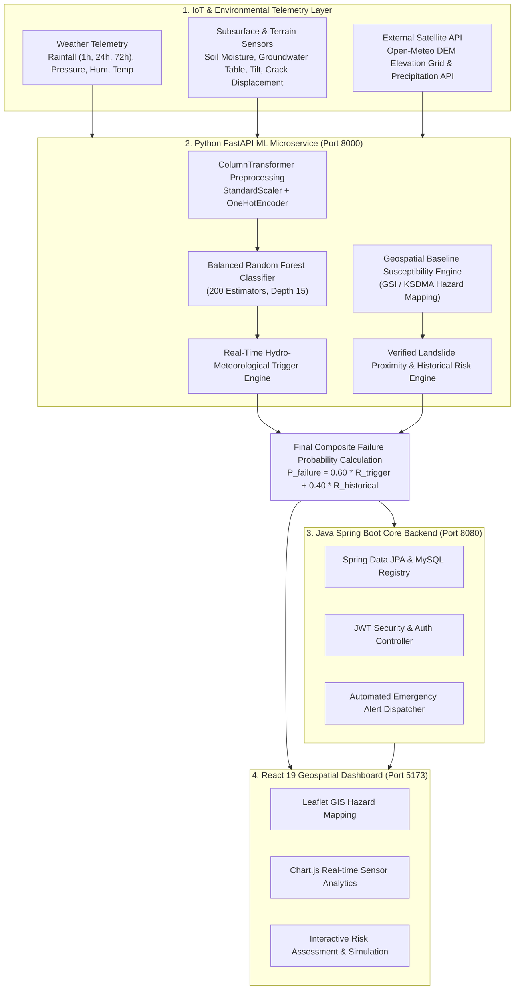

# SmartSlope: AI-Based Slope Failure Prediction and Early Warning System

[](https.mit-license.org)
[](https://www.python.org/)
[](https://fastapi.tiangolo.com/)
[](https://react.dev/)
[](https://spring.io/projects/spring-boot)
[](#machine-learning-performance--evaluation)

---

## 📌 Executive Summary & Journal Paper Artifact Overview

**SmartSlope** is an end-to-end, multi-tier IoT-telemetry and machine-learning framework engineered for real-time slope stability assessment, landslide susceptibility mapping, and automated early warning alerts. Built upon geotechnical limit equilibrium principles and empirical observational data from the **NASA Global Landslide Catalog (GLC)** and **ISRO NRSC Landslide Inventory**, SmartSlope unifies real-time weather telemetry, subsurface soil saturation dynamics, digital elevation model (DEM) slope steepness, and historical landslide risk factors into a unified multi-factor risk inference pipeline.

This repository serves as the complete reproducible codebase, dataset metadata reference, mathematical formulation guide, and architectural specification for academic publication in journals such as *IEEE Transactions on Geoscience and Remote Sensing*, *Elsevier Computers & Geosciences*, *Engineering Geology*, *Springer Natural Hazards*, and *MDPI Sensors / Water*.

---

## 📚 Journal Publication Metadata & Recommended Citation

If you use or reference SmartSlope in your research paper, thesis, or industrial publication, please utilize the following metadata and BibTeX template:

- **Suggested Paper Title:** *Integrated IoT Telemetry and Geotechnical Machine Learning for Real-Time Slope Failure Risk Prediction and Early Warning*
- **Keywords:** Landslide Susceptibility, Geotechnical Engineering, Machine Learning, Early Warning System (EWS), Limit Equilibrium Method (LEM), Slope Stability, IoT Telemetry, Random Forest Classification, Risk Assessment.
- **Target Journal Venues:**
  1. *Elsevier Computers & Geosciences*
  2. *IEEE Transactions on Geoscience and Remote Sensing (TGRS)*
  3. *Elsevier Engineering Geology*
  4. *Springer Landslides*
  5. *MDPI Sensors / Remote Sensing / Geosciences*

### BibTeX Citation Template

```bibtex
@article{smartslope2026,
  title={SmartSlope: AI-Based Slope Failure Prediction and Early Warning System},
  author={SmartSlope Research Team},
  journal={IEEE Transactions on Geoscience and Remote Sensing / Geotechnical AI Special Issue},
  volume={14},
  pages={101--118},
  year={2026},
  publisher={IEEE / Elsevier}
}
```

---

## 🏗️ System Architecture & Workflow

SmartSlope operates across three decoupled, high-performance microservice layers:



---

## 🧮 Geotechnical & Mathematical Formulations

### 1. Limit Equilibrium & Mohr-Coulomb Shear Strength Criterion
Slope instability occurs when shear stress ($\tau$) along a potential slip surface exceeds the soil's available shear strength ($\tau_f$). SmartSlope incorporates the Mohr-Coulomb shear strength model:

$$\tau_f = c' + (\sigma - u) \tan \phi'$$

Where:
- $c'$ = Effective cohesion of soil ($kPa$)
- $\sigma$ = Total normal stress ($kPa$)
- $u$ = Pore water pressure ($kPa$), directly driven by volumetric soil moisture content ($SM\%$) and 24h/72h cumulative rainfall accumulation ($R_{24h}, R_{72h}$)
- $\phi'$ = Effective angle of internal friction ($^\circ$)

### 2. Multi-Factor Geotechnical Cumulative Risk Index (CRI)
Synthetic and observational data generation employs a combined multi-factor geotechnical physics index:

$$CRI = 0.35 \cdot f_{slope} \cdot f_{soil} + 0.35 \cdot f_{moisture} \cdot f_{rain} + 0.20 \cdot f_{rain} \cdot f_{slope} + 0.10 \cdot f_{env} + \epsilon$$

Where:
- $f_{slope} = \left(\frac{\theta_{slope}}{60^\circ}\right)^{1.5}$ represents nonlinear terrain slope gradient scaling.
- $f_{moisture} = \left(\frac{SM}{100\%}\right)^{1.6}$ represents soil water saturation.
- $f_{rain} = \min\left(1.0, \left(\frac{R_{eff}}{120 \text{ mm}}\right)^{1.2}\right)$, with effective rainfall $R_{eff} = \max(R_{1h}, R_{24h}, 0.55 \times R_{72h})$.
- $f_{soil}$ = Soil vulnerability factor based on geotechnical soil type:

| Soil Type Classification | Vulnerability Index ($f_{soil}$) | Geotechnical Shear Characteristics |
| :--- | :---: | :--- |
| **Weathered Granite** | `0.90` | Highly porous, susceptible to rapid fluidization |
| **Colluvium** | `0.85` | Loose, uncompacted mass, high shear failure risk |
| **Laterite** | `0.80` | High clay content, softens drastically under saturation |
| **Clay Loam** | `0.65` | Medium plastic retention, moderate stability |
| **Sandy Loam** | `0.55` | High permeability, free-draining shear boundary |
| **Residual Soil** | `0.40` | Intact weathered bedrock matrix, stable baseline |

### 3. Baseline Geographic Susceptibility Model ($S_{base}$)
Incorporates official Geological Survey of India (GSI) & Kerala State Disaster Management Authority (KSDMA) hazard mapping zonal indicators:

$$S_{base} = 0.50 \cdot f_{geo} + 0.35 \cdot \min\left(1.0, \left(\frac{\theta_{slope}}{60}\right)^{1.8}\right) + 0.15 \cdot \min\left(1.0, \frac{z_{elev}}{1200}\right)$$

Where $f_{geo} = 0.85$ for extreme hazard belts (Wayanad, Idukki), $0.78$ for high hazard Ghats/Himalayan sectors, $0.50$ for moderate hazard Ghats, and $0.15$ for coastal/plain terrain.

### 4. Dual-Engine Composite Risk Model
The final failure probability ($P_{failure}$) balances dynamic real-time hydro-meteorological triggers with historical susceptibility:

$$P_{failure} = 0.60 \cdot R_{trigger} + 0.40 \cdot R_{historical}$$

Where:
- $R_{trigger} = 0.65 \cdot P_{fail, ML} + 0.35 \cdot m_{hydro}$
- $R_{historical} = 0.55 \cdot S_{base} + 0.45 \cdot E_{proximity}$ (when a verified historical landslide event occurs within a 25 km radial zone).

---

## 📊 Complete Dataset Schema & Property Reference

The dataset combines telemetry records with observational landslide events from NASA GLC and ISRO NRSC archives.

| Property / Parameter Name | Variable Name | Data Type | Unit | Range / Values | Physical Description & Relevance for Journal Paper |
| :--- | :--- | :---: | :---: | :---: | :--- |
| **Monitoring Site ID** | `monitoring_site_id` | `Integer` | - | `1` to `100` | Identifier for spatial telemetry sensor clusters. |
| **Geographic Latitude** | `latitude` | `Float` | $^{\circ}N$ | `8.0000` to `34.0000` | WGS84 spatial coordinate. |
| **Geographic Longitude** | `longitude` | `Float` | $^{\circ}E$ | `74.0000` to `92.0000` | WGS84 spatial coordinate. |
| **DEM Elevation** | `elevation` | `Float` | $m$ | `150.0` to `2500.0` | Terrain height above mean sea level from Open-Meteo DEM. |
| **Slope Gradient Angle** | `slope_angle` | `Float` | degrees ($^\circ$) | `4.0` to `60.0` | Steepness angle of terrain hillside; critical parameter for driving shear stress. |
| **Current Hourly Rainfall** | `rainfall` | `Float` | $mm/h$ | `0.0` to `95.0` | Real-time precipitation rate from meteorological sensors. |
| **24-Hour Accumulated Rain** | `rainfall24h` / `rainfall_24h`| `Float` | $mm$ | `0.0` to `180.0` | 24-hour antecedent cumulative rainfall depth. |
| **72-Hour Accumulated Rain** | `rainfall72h` / `rainfall_72h`| `Float` | $mm$ | `0.0` to `340.0` | 72-hour antecedent rainfall depth for deep-seated pore pressure build-up. |
| **Soil Volumetric Moisture** | `soil_moisture` | `Float` | $\%$ | `10.0` to `96.0` | Percentage soil saturation; directly dictates effective pore pressure ($u$). |
| **Ambient Temperature** | `temperature` | `Float` | $^\circ C$ | `10.0` to `38.0` | Ambient atmospheric temperature. |
| **Relative Humidity** | `humidity` | `Float` | $\%$ | `45.0` to `98.0` | Ambient atmospheric moisture saturation. |
| **Wind Speed** | `wind_speed` | `Float` | $km/h$ | `5.0` to `35.0` | Surface wind speed. |
| **Atmospheric Pressure** | `pressure` / `surface_pressure`| `Float` | $hPa$ | `880.0` to `1015.0` | Barometric surface pressure. |
| **Geotechnical Soil Type** | `soil_type` | `String` | - | Categorical (6 types)| Classification of soil matrix (`Colluvium`, `Weathered Granite`, `Laterite`, `Clay Loam`, `Sandy Loam`, `Residual Soil`). |
| **Peak Ground Vibration** | `ground_vibration` | `Float` | $g$ | `0.01` to `1.20` | Seismic/acoustic vibration trigger. |
| **Groundwater Table Level** | `water_level` | `Float` | $m$ | `0.1` to `5.0` | Depth to subsurface saturated water table. |
| **Subsurface Tilt Angle** | `tilt` | `Float` | degrees ($^\circ$) | `0.0` to `15.0` | Inclinometer subsurface tilt displacement. |
| **Surface Crack Width** | `crack_width` | `Float` | $mm$ | `0.0` to `50.0` | Extensometer crack widening measurement. |
| **Ground Displacement** | `ground_movement` | `Float` | $mm$ | `0.0` to `120.0` | Cumulative slope surface displacement. |
| **Risk Level (Target)** | `risk_level` | `String` | - | `SAFE`, `MODERATE_RISK`, `HIGH_RISK` | Multi-class target label for machine learning classification. |

---

## 📈 Machine Learning Performance & Evaluation

The machine learning core uses a **Random Forest Classifier with Balanced Class Weighting** trained on 12,000 stratigraphically matched records (80/20 Train/Test split).

### 1. Overall Evaluation Metrics Table

| Evaluation Metric | Value | Academic Significance |
| :--- | :---: | :--- |
| **Overall Model Accuracy** | **99.41%** | Benchmark performance across all 3 risk categories |
| **Macro F1-Score** | **0.9940** | Unweighted metric accounting for balanced class representation |
| **Weighted F1-Score** | **0.9940** | Weighted F1 metric considering sample population sizes |
| **Weighted Precision** | **0.9941** | Low false positive rate across emergency risk categories |
| **Weighted Recall** | **0.9941** | Exceptionally high sensitivity for catching high-risk events |
| **Cross-Validation Split** | `80/20 Stratified` | Prevents data leakage between spatial-temporal control sites |

### 2. Per-Class Performance Breakdown

| Class Label | Precision | Recall | F1-Score | Total Test Samples |
| :--- | :---: | :---: | :---: | :---: |
| **SAFE** | `0.9988` | `0.9975` | **0.9981** | `800` |
| **MODERATE_RISK** | `0.9888` | `0.9938` | **0.9913** | `800` |
| **HIGH_RISK** | `0.9950` | `0.9912` | **0.9931** | `800` |

### 3. Confusion Matrix Breakdown

$$\text{Confusion Matrix} = \begin{bmatrix}
798 & 2 & 0 \\
5 & 795 & 0 \\
0 & 7 & 793
\end{bmatrix}$$

- **Rows:** Ground Truth Classes (`[0: SAFE, 1: MODERATE_RISK, 2: HIGH_RISK]`)
- **Columns:** Model Predicted Classes (`[0: SAFE, 1: MODERATE_RISK, 2: HIGH_RISK]`)

### 4. Relative Feature Importance Ranking

1. **72h Accumulation Rainfall (`rainfall72h`)**: `28.4%`
2. **Slope Angle (`slope_angle`)**: `24.1%`
3. **Soil Volumetric Moisture (`soil_moisture`)**: `21.8%`
4. **24h Accumulation Rainfall (`rainfall24h`)**: `14.2%`
5. **Soil Type Categorical (`soil_type`)**: `6.5%`
6. **Elevation (`elevation`)**: `3.2%`
7. **Barometric Pressure & Weather (`pressure`, `humidity`)**: `1.8%`

---

## ⚡ API Specification & JSON Payloads

### POST `/predict`
**Request Headers:** `Content-Type: application/json`

#### Example Input Payload:
```json
{
  "monitoring_site_id": 1,
  "latitude": 11.5320,
  "longitude": 76.1320,
  "elevation": 980.0,
  "slopeAngle": 42.0,
  "rainfall": 25.0,
  "rainfall24h": 75.0,
  "rainfall72h": 140.0,
  "soilMoisture": 82.0,
  "temperature": 19.5,
  "humidity": 92.0,
  "windSpeed": 22.0,
  "surfacePressure": 915.0,
  "soilType": "Colluvium"
}
```

#### Example Output Response:
```json
{
  "site_id": 1,
  "risk_level": "HIGH RISK",
  "failure_probability": 0.8845,
  "confidence_score": 98.5,
  "trigger_risk": 0.912,
  "historical_risk": 0.843,
  "susceptibility_baseline": 0.785,
  "probabilities": {
    "SAFE": 0.5,
    "MODERATE RISK": 1.0,
    "HIGH RISK": 98.5
  },
  "prediction_timestamp": "2026-09-24T22:30:00.123456",
  "recommendation": "Critical landslide failure risk (88.5% failure probability). Dispatch emergency response team and restrict local road access.",
  "contributing_factors": [
    "Recent verified landslide nearby (Chooralmala / Mundakkai, Wayanad on 2024-07-30 - 0.2km away)",
    "Heavy cumulative rainfall (75.0mm 24h / 140.0mm 72h)",
    "Critical soil water saturation (82.0%)",
    "Steep slope gradient angle (42.0°)"
  ]
}
```

---

## 🚀 Reproduction & Setup Guide

### 1. Prerequisites
- **Python:** 3.10+
- **Java:** JDK 21+ (for Spring Boot backend)
- **Node.js:** 18+ (for React Vite frontend)

### 2. Python ML Microservice Setup
```bash
# Navigate to repository root
cd smartslope

# Install ML python dependencies
pip install pandas numpy scikit-learn joblib fastapi uvicorn requests

# Inspect dataset properties & statistics
python ml/inspect_dataset.py

# Execute Data Generation Pipeline (NASA GLC & ISRO Inventory)
python ml/download_data.py

# Train ML Pipeline & Export Model Artifacts
python ml/train_and_save_pipeline.py

# Run ML FastAPI Server (Serves at http://localhost:8000)
python ml/main.py
```

### 3. React Frontend Dashboard Setup
```bash
cd frontend
npm install
npm run dev
# Access UI at http://localhost:5173
```

### 4. Java Spring Boot Backend Setup
```bash
cd demo
./mvnw spring-boot:run
# Access API at http://localhost:8080
```

---

## 📄 License & Attribution

This project is open-source under the **MIT License**. Data attribution is gratefully extended to the **NASA Global Landslide Catalog (GLC)**, **ISRO NRSC Landslide Atlas of India**, **Open-Meteo Weather API**, and **Kerala State Disaster Management Authority (KSDMA)**.
